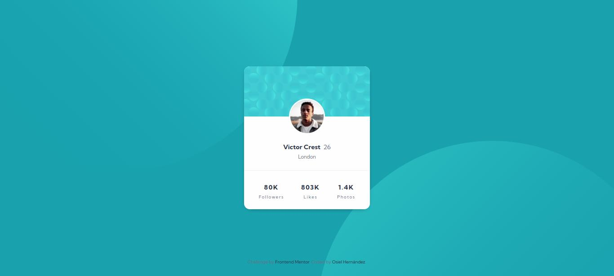

# Frontend Mentor - Profile card component solution

This is a solution to the [Profile card component challenge on Frontend Mentor](https://www.frontendmentor.io/challenges/profile-card-component-cfArpWshJ). Frontend Mentor challenges help you improve your coding skills by building realistic projects. 

## Table of contents

- [Overview](#overview)
  - [The challenge](#the-challenge)
  - [Screenshot](#screenshot)
  - [Links](#links)
- [My process](#my-process)
  - [Built with](#built-with)
  - [Useful resources](#useful-resources)
- [Author](#author)

## Overview

### The challenge

- Build out the project to the designs provided

### Screenshot

### Links

- Solution URL: https://www.frontendmentor.io/solutions/profile-card-component-with-flexbox-Hn8NiirLZQ
- Live Site URL: https://xxosielxx.github.io/profile-card-component-challenge

## My process

### Built with

- Semantic HTML5 markup
- CSS custom properties
- Flexbox
- Mobile-first workflow

### Useful resources

- [Blackbox AI](https://www.blackbox.ai/) - Blackbox AI is an AI-powered coding assistant designed to help developers tackle coding challenges efficiently. It's primary features include: code generation, real-time suggestions, image-to-text analysis and community library access. Blackbox AI integrates seamlessly with Visual Studio Code, making coding faster and easier.
- [Stackoverflow](https://stackoverflow.com/) - This is an excelent way to search for solutions. In this popular website I finded solutions to my code problems many times because I'm never the first to have a specific problem appear.

## Author

- [Website ](https://xxosielxx.github.io/osez-folio)
- [LinkedIn](https://www.linkedin.com/in/osiel-hern%C3%A1ndez-rodr%C3%ADguez-9869612a1/)
- [Github](https://github.com/xXOsielXx)
- [Stackoverflow Español](https://es.stackoverflow.com/)
- [Frontend Mentor](https://www.frontendmentor.io/profile/xXOsielXx)